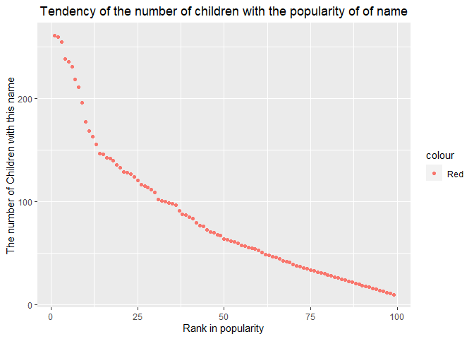

p8105\_hw2\_xy2517
================
Xuehan Yang
2021/10/2

``` r
library(tidyverse)
library(readxl)
```

# Problem 1

**Read and clean the Mr.Trash Wheel sheet.**

``` r
trashwheel = 
  read_excel(path = "./data/Trash-Wheel-Collection-Totals-8-6-19.xlsx",range = cell_cols("A:N")) %>% 
  janitor::clean_names() %>% 
  mutate(sports_balls = round(sports_balls,0)) %>%  # round sports_balls to integer
  rename(weight = weight_tons, volumn = volume_cubic_yards) %>%  # change column name
  drop_na(dumpster)

head(trashwheel,3) %>% knitr::kable()
```

| dumpster | month | year | date       | weight | volumn | plastic\_bottles | polystyrene | cigarette\_butts | glass\_bottles | grocery\_bags | chip\_bags | sports\_balls | homes\_powered |
|---------:|:------|-----:|:-----------|-------:|-------:|-----------------:|------------:|-----------------:|---------------:|--------------:|-----------:|--------------:|---------------:|
|        1 | May   | 2014 | 2014-05-16 |   4.31 |     18 |             1450 |        1820 |           126000 |             72 |           584 |       1162 |             7 |              0 |
|        2 | May   | 2014 | 2014-05-16 |   2.74 |     13 |             1120 |        1030 |            91000 |             42 |           496 |        874 |             5 |              0 |
|        3 | May   | 2014 | 2014-05-16 |   3.45 |     15 |             2450 |        3100 |           105000 |             50 |          1080 |       2032 |             6 |              0 |

**Read and clean 2018 and 2019 precipitation data.**

``` r
rain_2019 = 
  read_excel(path = "./data/Trash-Wheel-Collection-Totals-8-6-19.xlsx", sheet = "2019 Precipitation", skip = 1) %>% 
  janitor::clean_names() %>% 
  drop_na(total,month) %>% 
  mutate(year = 2019)

rain_2018 = 
  read_excel(path = "./data/Trash-Wheel-Collection-Totals-8-6-19.xlsx", sheet = "2018 Precipitation", skip = 1) %>% 
  janitor::clean_names() %>% 
  drop_na(total,month) %>% 
  mutate(year = 2018)
```

**Combine the rain\_2018 and rain\_2019 together.**

``` r
precipitation = bind_rows(rain_2018,rain_2019) %>% 
  mutate(month = month.name[month]) %>%  # change numeric month name to character
  relocate(year,month)

head(precipitation,3) %>% knitr::kable()
```

| year | month    | total |
|-----:|:---------|------:|
| 2018 | January  |  0.94 |
| 2018 | February |  4.80 |
| 2018 | March    |  2.69 |

**Description:**

-   As for trashwheel, there are total 344 observations, 14 variables
    including dumpster, month, year, date, weight, volumn,
    plastic\_bottles, polystyrene, cigarette\_butts, glass\_bottles,
    grocery\_bags, chip\_bags, sports\_balls, homes\_powered. For
    example, there were 4.31 tons of trash on 2014-05-16, which included
    1450 plastic bottles, 1820 polystyrene and so on. The median number
    of sports balls in a dumpster in 2019 is 8.5 units.

-   As for the Precipitation, there are total 18 observations, 3 columns
    which include year, month, total. The total precipitation in 2018 is
    70.33 inches.

# Problem 2

**Clean the data in pols-month.**

``` r
pols = read_csv(file = "./data/pols-month.csv") %>%
  janitor::clean_names() %>% 
  separate(mon, into = c("year", "month", "day"),"-" ) %>% 
  mutate(month = month.name[as.integer(month)], president = ifelse(prez_dem == 1, "dem", "gop"), year = as.integer(year)) %>% # Replace char month with full name
  select(-prez_dem,-prez_gop,-day)

head(pols,3) %>% knitr::kable()
```

| year | month    | gov\_gop | sen\_gop | rep\_gop | gov\_dem | sen\_dem | rep\_dem | president |
|-----:|:---------|---------:|---------:|---------:|---------:|---------:|---------:|:----------|
| 1947 | January  |       23 |       51 |      253 |       23 |       45 |      198 | dem       |
| 1947 | February |       23 |       51 |      253 |       23 |       45 |      198 | dem       |
| 1947 | March    |       23 |       51 |      253 |       23 |       45 |      198 | dem       |

**Clean the data in snp.csv.**

Separate data into year, month and day. Then delete day and change year
to a 4 digit form.

``` r
snp_raw = read_csv(file = "./data/snp.csv") %>% 
  janitor::clean_names() %>% 
  separate(date,into = c( "month", "day", "year"),"/") %>%
  select(-day) %>% # remove day column
  mutate(year = ifelse(as.integer(year) <= 15,as.integer(year) + 2000,as.integer(year) + 1900)) # it can be run just once.
```

Arrange year and month, then replace numeric month name with full name.

``` r
snp = snp_raw %>% 
  arrange(as.integer(year),as.integer(month)) %>% # change character into int , then arrange
  mutate(month = month.name[as.integer(month)]) %>% 
  relocate(year,month) # let year and month be the leading variable

head(snp,3) %>% knitr::kable()
```

| year | month    | close |
|-----:|:---------|------:|
| 1950 | January  | 17.05 |
| 1950 | February | 17.22 |
| 1950 | March    | 17.29 |

**Tidy the unemployment data.**

``` r
unemployment = read_csv(file = "./data/unemployment.csv") %>% 
  pivot_longer(
    Jan:Dec,
    names_to = "month",
    values_to = "percentage"
  ) %>% 
  mutate(month = replace(month,month == month.abb, month.name)) %>%  #replace abbreviation to full month name using Replace()
  janitor::clean_names()

head(unemployment,3) %>% knitr::kable()
```

| year | month    | percentage |
|-----:|:---------|-----------:|
| 1948 | January  |        3.4 |
| 1948 | February |        3.8 |
| 1948 | March    |        4.0 |

**Join the three datasets together.**

``` r
merge_df = left_join(pols, snp, by = c("year", "month")) %>% 
  left_join(unemployment, by = c("year", "month"))

tail(merge_df,3) %>% knitr::kable()
```

| year | month | gov\_gop | sen\_gop | rep\_gop | gov\_dem | sen\_dem | rep\_dem | president |   close | percentage |
|-----:|:------|---------:|---------:|---------:|---------:|---------:|---------:|:----------|--------:|-----------:|
| 2015 | April |       31 |       54 |      244 |       18 |       44 |      188 | dem       | 2085.51 |        5.4 |
| 2015 | May   |       31 |       54 |      245 |       18 |       44 |      188 | dem       | 2107.39 |        5.5 |
| 2015 | June  |       31 |       54 |      246 |       18 |       44 |      188 | dem       | 2063.11 |        5.3 |

**Description**

-   pols: it contains 822 observations of 9 variables related to the
    number of national politicians who are democratic or republican
    ranging from Jan.1947 to Jun.2015, totally 68 years. Key variales
    include year, month, gov\_gop, sen\_gop, rep\_gop, gov\_dem,
    sen\_dem, rep\_dem, president. “gop” indicates republic and “dem”
    indicates democratic. “gov\_gop”, “sen\_gop” and “rep\_gop” means
    the number of republic governors, senators and representatives.
    “gov\_dem”, “sen\_dem” and “rep\_dem” means the number of democratic
    governors, senators and representatives.

-   snp: it contains 787 observations of 3 variables related to Standard
    & Poor’s stock market index (S&P), often used as a representative
    measure of stock market as a whole. It ranges from Jan.1950 to
    July.2015, totally 65 years. Key variales include year, month,
    close, among which “close” are the closing values of the S&P stock
    index on the associated date.

-   unemployment: it contains 816 observations of 3 variables related to
    percentages of unemployment on the associated data. It ranges from
    Jan.1948 to June.2015, totally 67 years. Key variales include year,
    month, percentage.

-   merge\_df: final datasets contains 822 observations of 11 variables
    ranging from Jan.1947 to July.2015, totally 68 years.

# Problem 3

**Tidying the popularity of baby names data.**

``` r
baby_names = read_csv(file = "./data/Popular_Baby_Names.csv", col_types = "ccccii") %>% 
  janitor::clean_names() %>% 
  mutate(gender = str_to_lower(gender), 
         ethnicity = str_to_lower(ethnicity),
         childs_first_name = str_to_lower(childs_first_name)) %>% 
  distinct() %>%  # remove distinct rows based on all column
  mutate(
    ethnicity = recode(ethnicity, 
                       "asian and paci" = "asian and pacific islander",
                       "black non hisp" = "black non hispanic",
                       "white non hisp" = "white non hispanic"
                       ))

head(baby_names,3) %>% knitr::kable()
```

| year\_of\_birth | gender | ethnicity                  | childs\_first\_name | count | rank |
|:----------------|:-------|:---------------------------|:--------------------|------:|-----:|
| 2016            | female | asian and pacific islander | olivia              |   172 |    1 |
| 2016            | female | asian and pacific islander | chloe               |   112 |    2 |
| 2016            | female | asian and pacific islander | sophia              |   104 |    3 |

**Produce a table showing the rank in popularity of the name “Olivia” as
a female baby name over time.**

``` r
baby_names %>% 
  filter(childs_first_name == "olivia", gender == "female") %>%
  select(year_of_birth, ethnicity,rank) %>% 
  pivot_wider(
    names_from = year_of_birth,
    values_from = rank
  ) %>% knitr::kable() # produce a nicer table
```

| ethnicity                  | 2016 | 2015 | 2014 | 2013 | 2012 | 2011 |
|:---------------------------|-----:|-----:|-----:|-----:|-----:|-----:|
| asian and pacific islander |    1 |    1 |    1 |    3 |    3 |    4 |
| black non hispanic         |    8 |    4 |    8 |    6 |    8 |   10 |
| hispanic                   |   13 |   16 |   16 |   22 |   22 |   18 |
| white non hispanic         |    1 |    1 |    1 |    1 |    4 |    2 |

**Produce a table showing the rank in popularity of the name “Olivia” as
a male baby name over time.**

``` r
male = baby_names %>% 
  filter(gender == "male") %>%
  arrange(desc(year_of_birth),rank)

most_pop_male = pull(male,childs_first_name)[1]
```

**Display the rank of the most popular male name ethan with year and
ethnicity.**

``` r
baby_names %>% 
  filter(childs_first_name == most_pop_male, gender == "male") %>%
  select(year_of_birth, ethnicity,rank) %>% 
  pivot_wider(
    names_from = year_of_birth,
    values_from = rank
  ) %>% knitr::kable() # produce a nicer table
```

| ethnicity                  | 2016 | 2015 | 2014 | 2013 | 2012 | 2011 |
|:---------------------------|-----:|-----:|-----:|-----:|-----:|-----:|
| asian and pacific islander |    1 |    2 |    2 |    2 |    2 |    1 |
| black non hispanic         |    5 |    5 |    1 |    1 |    3 |    6 |
| hispanic                   |    7 |    3 |    5 |    5 |    4 |    6 |
| white non hispanic         |   20 |   19 |   18 |   23 |   21 |   26 |

**Scatterplot showing the number of children with a name against the
rank in popularity of the name.**

Firstly, select the target subdatasets.

``` r
plot_df = baby_names %>% 
  filter(gender == "male", ethnicity == "white non hispanic", year_of_birth == 2016)
```

Then,draw plots between number of children with a name and rank in
popularity.

``` r
num_popularity_plot = 
  ggplot(plot_df, aes(x = rank, y = count)) + 
  geom_point(aes(color = "Red")) +
  xlab("Rank in popularity") +
  ylab("The number of Children with this name") +
  ggtitle("Tendency of the number of children with the popularity of of name") +
  theme(plot.title = element_text(hjust = 0.5))

num_popularity_plot
```

<!-- -->

``` r
ggsave("./plots/num_popularity_plot.png", width = 10, height = 8)
```
